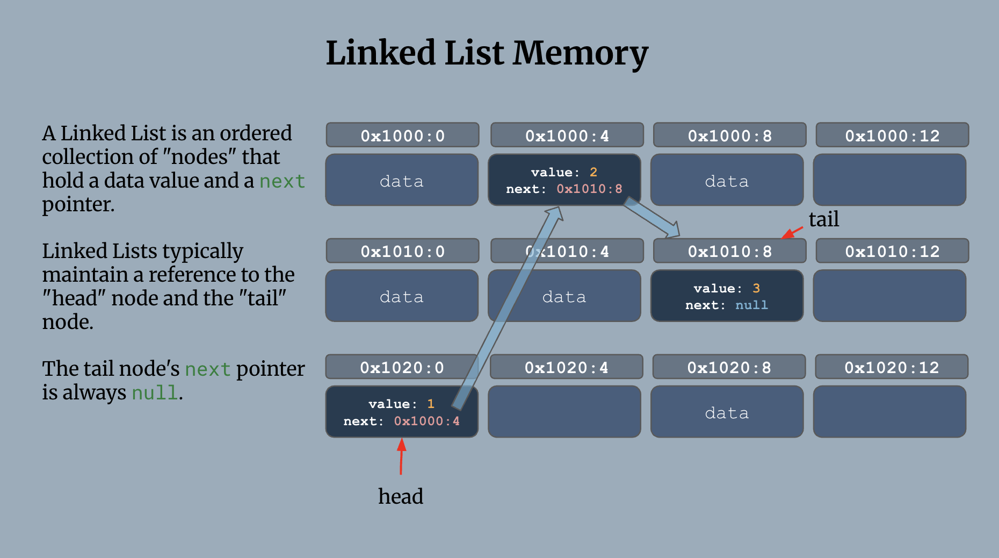
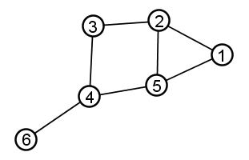

# 3. Nodes & Linked Lists

* [Essential Questions](3-nodes-linked-lists.md#essential-questions)
* [Key Concepts](3-nodes-linked-lists.md#key-concepts)
* [Problem: What Happens When an Array Runs Out of Room?](3-nodes-linked-lists.md#problem-what-happens-when-an-array-runs-out-of-room)
* [Linked Lists and Nodes](3-nodes-linked-lists.md#linked-lists-and-nodes)
  * [Arrays vs. Linked Lists](3-nodes-linked-lists.md#arrays-vs-linked-lists)
* [Implementing a Linked Lists](3-nodes-linked-lists.md#implementing-a-linked-lists)
  * [Node Class](3-nodes-linked-lists.md#node-class)
  * [LinkedList Class](3-nodes-linked-lists.md#linkedlist-class)
  * [Append](3-nodes-linked-lists.md#append)
  * [Prepend](3-nodes-linked-lists.md#prepend)
  * [removeHead](3-nodes-linked-lists.md#removehead)
  * [removeTail](3-nodes-linked-lists.md#removetail)
  * [contains](3-nodes-linked-lists.md#contains)
  * [insertAtIndex](3-nodes-linked-lists.md#insertatindex)
  * [removeAtIndex](3-nodes-linked-lists.md#removeatindex)
* [Revisiting Stacks and Queues](3-nodes-linked-lists.md#revisiting-stacks-and-queues)
* [Algorithm: Reverse a Linked List](3-nodes-linked-lists.md#algorithm-reverse-a-linked-list)
* [Linked Lists are Graphs](3-nodes-linked-lists.md#linked-lists-are-graphs)

## Essential Questions

By the end of this lesson, you should be able to answer these questions:

1. What happens when you add a value to a full Array? What is the runtime of the `push` operation in this situation?
2. What is a graph, and what do all graphs have in common?
3. What is a node? What does the `head` of a linked list refer to? What does the `tail` refer to?
4. What are the tradeoffs between linked lists and arrays?
5. What are the run times for insertion, deletion, and accessing values in a linked list?

## Key Concepts

* **Graph** - a category of abstract data type used to organize collections of data with _relationships_. All graphs are made up of nodes containing each data point and edges connecting them.
  * **Node** - a single unit of data storage in a graph. Depending on the structure, a node may point to a `next`, `prev` (previous), `parent`, or `children` node.
  * **Edge** - a connection between two nodes.
* **Linked List** - a graph structure made of nodes chained together in a single-file line, where each node points to the `next` node in the sequence. To access any node in the list, you must start at the `head` node of the list and traverse through the `next` pointers of each node.
  * **Singly Linked List** - a linked list where each node _only_ points to the `next` node, allowing traversal in one direction only.
  * **`head`** - the first node in a linked list.
  * **`tail`** - the last node in a linked list.
* **Traverse** - to visit the nodes of a data structure in a particular order.
* **Random Access** - the ability to access any element in a collection directly (e.g. by index), regardless of its position. Arrays support random access.
* **Sequential Access** - the requirement to visit elements of a collection in order, starting from the beginning, to reach a given element. Linked lists only support sequential access.

## Arrays: The Downsides of Contiguous Memory

We've learned that an Array's values live in **contiguous memory** (one right after another, with no gaps). That's what makes insertion and indexed access O(1): the computer can calculate memory addresses with simple arithmetic.



But contiguous memory comes with two distinct downsides.
1. Removing values from the beginning or middle is slow
2. The Array must be moved to a larger block of memory when it fills up

**<details><summary>(1) What happens when you remove a value from the beginning of an Array (`array.shift()`) or from the middle of an Array (`array.splice()`)? What is the runtime of these operations?</summary>**

In order for Arrays to maintain O(1) retrieval, the Array's contents must:
1. Be stored contiguously (no gaps between values)
2. Have the first value in the first address

As a result, removing values from anywhere other than the end of an Array requires the computer to shift all values forward to close the gaps:

1. Values before the removed index remain in their original position
2. Values after the removed index are shifted forward by 1

While these are **O(n)** operations, they only have to happen at the moment a value is removed. Performing these removals in O(n) time allows future retrievals by index to run in O(1) time.

**What would it look like if we didn't close the gaps?** 

If we deleted the value at index `0` and did nothing else, then the first real value in the array would now live at index `1`. When calculating the position of any other value by position (e.g. `arr[3]`), we would need to remember to start at the second address. This is still constant time but it adds an additional piece of meta-data to track.

However, if we also removed values from the middle of the Array, leaving gaps in the Array, we would no longer be able to reliably calculate the address of any value in the Array. We'd have to loop through the addresses and checking to see if a gap exists, making retrieval O(n).

</details>

**<details><summary>Q: Why do Arrays need to be moved to a larger block of memory when they fill up?</summary>**

The new value can't simply be tacked onto the end — the memory address right after the array might already be occupied by something else entirely. So the runtime has to:

1. Find and allocate a **new**, larger block of contiguous memory somewhere else.
2. Copy **every existing element** into that new block.
3. Add the new value.
4. Free the old block.

That's an **O(n)** operation. And even though this is a worst-case scenario (that is, most of the time pushing is an O(1) operation), it happens often enough to become a problem worth solving!

In practice, JavaScript engines soften this by over-allocating (grabbing more room than you currently need, so most `push` calls don't trigger a resize) — but the underlying cost is still there, and it will eventually be paid. **Contiguous memory is the property that makes Array access fast while also the reason growing an Array can be expensive.**

</details>

## Linked Lists and Nodes

A **Linked List** is an ordered collection of **Nodes** that each hold a data value and a `next` pointer. Since each node holds a pointer to the address of the next node, the nodes can be placed anywhere in memory.




By keeping a reference to the **head node** and the **tail node**, a Linked List gets O(1) runtime for insertion at the front/end as well as removal from the front.


### Arrays vs. Linked Lists


| Operation                   | Array                               | Linked List                                                                                            |
| --------------------------- | ----------------------------------- | ------------------------------------------------------------------------------------------------------ |
| Access by index             | O(1)                                | O(n) — must traverse the list from the `head`                                                          |
| Insert/remove at the front  | O(n) — every other element shifts   | O(1) — just repoint the `head`                                                                         |
| Insert/remove at the end    | O(1) (unless re-sizing is needed)   | O(1) insertion, O(n) removal                                                                           |
| Insert/remove in the middle | O(n) — elements after have to shift | O(n) — traverse through the list until you find the node, then repoint `next` pointers around the node |

In the same way that we compare Arrays and Hashmaps, comparing Arrays and Linked Lists gives us a way to decide on the right data structure for the problem at hand. Neither is "better" — they're solving for different operations.

* An Array optimizes for O(1) random access and insertion/removal at the end (except when re-sizing is needed). Arrays sacrifice O(n) insertion/removal at the front.
* A Linked List optimizes for O(1) insertion/removal at the front and insertion at the end. Linked Lists sacrifice O(n) indexed access.

To better understand these runtimes, let's build a `Node` class which we can use to experiment with Linked Lists.

## Implementing a Linked Lists

### Node Class

To create Linked Lists, we just need a `Node` class to create objects that hold a `value` and a `next` pointer:

```js
class Node {
    constructor(value) {
        this.value = value;
        this.next = null;
    }
}

// Assembling a linked list by manually assigning next pointers
let head = new Node("a");
head.next = new Node("b");
head.next.next = new Node("c");

console.log(head); // What do you expect to see?
```

With a `Node` class, we can now begin to think through the logic for some basic list manipulations:
* Inserting at the tail
* Removing the head
* Inserting at the head
* Removing the tail

For each of these, consider: **what is the runtime complexity in Big-O notation?**



**<details><summary>Q: How does the runtime of adding/removing from the tail change with/without tracking a `tail` pointer?</summary>**

Adding to the tail:
* With a `tail` pointer, adding to the tail of the linked list is O(1). We just set the tails `next` pointer to the new node and update the `tail` to the new node.
* Without a `tail` pointer, we have to traverse the linked list from the `head` to reach the tail before insertion. This is O(n).

Removing the tail:
* Without a `tail` pointer, we have to traverse the linked list from the `head` to reach the *second-to-last* node and set its `next` pointer to `null`. This is O(n).
* With a `tail` pointer, we still have to traverse since we don't have any other way to access the *second-to-last* node. So it is still O(n).

</details>

**<details><summary>Q: What would giving each Node a `prev` pointer enable us to do? What would the tradeoff be?</summary>**

If each Node tracked the `prev` pointer, then removing the `tail` would become an O(1) operation with three steps:

1. Get the second-to-last node: `tail.prev`
2. Set it's `next` to `null`: `tail.prev.next = null`
3. Reset the `tail` to point to that node: `tail = tail.prev`

The tradeoff is that you have to store more data for each Node. If memory is not a concern, then adding a `prev` pointer is just upside if runtime efficiency is your primary concern.

A Linked List with both a `next` and a `prev` pointer is called a **Doubly Linked List**

</details>

### LinkedList Class

While the `Node` class manages pointers to subsequent nodes, the `LinkedList` itself holds only a reference to the `head` node, the `tail` node and methods for inserting, deleting, and traversing/searching the list.

```js
class LinkedList {
    constructor() {
        this.head = null;
        this.tail = null;
    }
    
    append(value) {
        // Add a Node to the end of the list and update the tail — O(1)
    }
    prepend(value) {
        // Add a Node to the beginning of the list and update the head — O(1)
    }
    removeHead() {
        // Remove the first Node and update the head — O(1)
    }
    removeTail() {
        // Remove the last Node — O(n)
    }
    contains(value) {
        // Return true if the given data value is held by a Node in the list. false otherwise — O(n)
    }
    insertAtIndex(index, value) {
        // Add a Node with the given value at the given index in the Linked List — O(n)
    }
    removeAtIndex(index) {
        // Remove the Node at the given index in the Linked List — O(n)
    }
}
```

Let's try implementing them!

### Append

* Inputs: `value` to add
* Behavior: Create a new `Node` holding the given `value` and update the `tail` to point to this new node.
* Runtime: O(1)
* Edge Case(s): What happens when the list is empty?

```js
const list = new LinkedList();
list.append('a')
list.append('b')
list.append('c')
console.log(list.head);
console.log(list.head.next);
console.log(list.head.next.next);
// Node { value: 'a', next: Node }
// Node { value: 'b', next: Node }
// Node { value: 'c', next: null }
```

<details>

<summary><strong>Solution</strong></summary>

```js
class LinkedList {
    constructor() {
        this.head = null;
        this.tail = null;
    }
    
    append(value) {
        const newNode = new Node(value);
        if (!this.head) {
            this.head = newNode;
        } 
        else {
            this.tail.next = newNode;
        }
        this.tail = newNode;
    }

    // other methods...
}
```

1. If the list is empty, set the `head` to point to the new Node, then set the `tail` to point to the new Node.
2. If the list has values, point the `tail` node at the new node, then set the `tail` to point to the new Node.

</details>

### Prepend

* Inputs: `value` to insert into the list as a new Node
* Behavior: Create a new `Node` holding the given `value`. It should be the new `head` of the linked list and it should point to the previous `head` of the linked list.
* Runtime: O(1)
* Edge Case(s): What happens when the list is empty? (Does `tail` also need to be set?)

```js
const list = new LinkedList();
list.prepend('c')
list.prepend('b')
list.prepend('a')
console.log(list.head);
console.log(list.head.next);
console.log(list.head.next.next);
// Node { value: 'a', next: Node }
// Node { value: 'b', next: Node }
// Node { value: 'c', next: null }
```

<details>

<summary><strong>Solution</strong></summary>

```js
class LinkedList {
    //...
    prepend(value) {
        const newNode = new Node(value);
        newNode.next = this.head;
        this.head = newNode;

        // if the list was empty, set the tail too
        if (this.tail === null) {
            this.tail = newNode;
        }
    }
    // ... other methods
}
```

1. Create the new Node and point its `next` at the current `head` (even if `head` is `null`, this is still a valid assignment).
2. Update `head` to point at the new Node — it's now the first node in the list.
3. If the list was empty before this call (`tail` was still `null`), the new Node is also the `tail`.

</details>

### removeHead

* Inputs: none
* Output: the `value` that was removed
* Behavior: remove the first `Node` in the list and update `head` (and `tail`, if the list becomes empty) accordingly.
* Runtime: O(1)
* Edge Case(s): What happens when the list is empty? What happens when the list only has one Node? (Does `tail` also need to be cleared?)

```js
const list = new LinkedList();
list.append('a');
list.append('b');
list.append('c');

console.log(list.removeHead()); // 'a'
console.log(list.head.value);   // 'b'
```

<details>

<summary><strong>Solution</strong></summary>

```js
class LinkedList {
    // ...
    removeHead() {
        if (!this.head) return null;

        const removedNode = this.head;
        this.head = this.head.next;

        if (!this.head) {
            // the list is now empty, so tail needs to be cleared too
            this.tail = null;
        }

        return removedNode.value;
    }
}
```

1. If the list is empty, there's nothing to remove.
2. Otherwise, save a reference to the current `head` so its `value` can be returned.
3. Move `head` forward to the next node — this alone detaches the old head from the list.
4. If that leaves `head` as `null`, the list just became empty, so `tail` needs to be cleared too, or it would be left pointing at a node that's no longer reachable from `head`.

</details>

### removeTail

* Inputs: none
* Output: the `value` that was removed
* Behavior: remove the last `Node` in the list and update `tail` accordingly.
* Runtime: O(n)
* Edge Case(s): What happens when the list is empty? What happens when the list only has one Node? (Does `head` also need to be cleared?)

```js
const list = new LinkedList();
list.append('a');
list.append('b');
list.append('c');

console.log(list.removeTail()); // 'c'
console.log(list.tail.value);   // 'b'
```

<details>

<summary><strong>Q: `removeHead` is O(1). Why can't `removeTail` reuse the same trick?</strong></summary>

`removeHead` works by moving the `head` pointer forward — but nodes only know what comes _after_ them, not what comes _before_. To remove the tail, something needs to update the second-to-last node's `next` pointer to `null`, and the only way to find the second-to-last node is to start at `head` and walk forward until you're one node short of the tail.

</details>

<details>

<summary><strong>Solution</strong></summary>

```js
class LinkedList {
    // ...
    removeTail() {
        if (!this.head) return null;

        const removedNode = this.tail;

        if (this.head === this.tail) {
            // only one node in the list
            this.head = null;
            this.tail = null;
            return removedNode.value;
        }

        let currNode = this.head;
        while (currNode.next !== this.tail) {
            currNode = currNode.next;
        }

        currNode.next = null;
        this.tail = currNode;
        return removedNode.value;
    }
}
```

1. If the list is empty, there's nothing to remove.
2. If there's only one node, removing it empties the whole list.
3. Otherwise, traverse from `head` until `currNode.next` _is_ the tail — that makes `currNode` the new second-to-last node.
4. Detach the old tail by setting `currNode.next = null`, then update `tail` to point at `currNode`.

This is **O(n)** — the traversal to find the node just before the tail is unavoidable with only a `next` pointer on each node (this is exactly the kind of removal a Doubly Linked List's `prev` pointer would make O(1) instead).

</details>

### contains

* Inputs: a `value` to search for
* Output: `true` if any node in the list holds that value, `false` otherwise
* Runtime: O(n)
* Edge Case(s): What happens when the list is empty? What happens when the value isn't found anywhere in the list?

```js
const list = new LinkedList();
list.append('a');
list.append('b');
list.append('c');

console.log(list.contains('b')); // true
console.log(list.contains('z')); // false
```

<details>

<summary><strong>Solution</strong></summary>

```js
class LinkedList {
    // ...
    contains(value) {
        let currNode = this.head;

        while (currNode !== null) {
            if (currNode.value === value) return true;
            currNode = currNode.next;
        }

        return false;
    }
}
```

1. Starting at `head`, follow `next` pointers one at a time, checking each node's `value` along the way.
2. If `currNode` ever becomes `null`, the whole list has been traversed without a match — return `false`.

This is **O(n)** — in the worst case (value not present, or it's the last node), every node has to be visited. Unlike an Array, there's no way to jump ahead or binary search here — a Linked List only supports sequential access.

</details>

### insertAtIndex

* Inputs: an `index` and a `value` to insert at that index
* Behavior: create a new Node holding `value` and place it at the given `index`, shifting the existing node at that index (and all nodes after it) back by one position.
* Runtime: O(n)
* Edge Case(s): What happens when `index` is `0`? What happens when `index` is the current length of the list (inserting at the very end)? (Does `tail` also need to be updated?)

```js
const list = new LinkedList();
list.append('a');
list.append('b');
list.append('d');

list.insertAtIndex(2, 'c');
console.log(list.head);
console.log(list.head.next);
console.log(list.head.next.next);
console.log(list.head.next.next.next);
// Node { value: 'a', next: Node }
// Node { value: 'b', next: Node }
// Node { value: 'c', next: Node }
// Node { value: 'd', next: null }
```

<details>

<summary><strong>Q: `prepend` and `append` are both O(1) (with a `tail` pointer). Why is `insertAtIndex` only O(n)?</strong></summary>

`prepend` and `append` both work at a position you already have a direct pointer to (`head` or `tail`), so there's no searching involved. `insertAtIndex` has to find the node currently sitting at `index - 1` first — and the only way to find it is to start at `head` and follow `next` pointers, counting as you go. That traversal is what makes it O(n), same as `contains`.

</details>

<details>

<summary><strong>Solution</strong></summary>

```js
class LinkedList {
    // ...
    insertAtIndex(index, value) {
        if (index === 0) {
            this.prepend(value);
            return;
        }

        const newNode = new Node(value);
        let currNode = this.head;
        let currIndex = 0;

        // walk to the node just before the target index
        while (currIndex < index - 1) {
            currNode = currNode.next;
            currIndex++;
        }

        newNode.next = currNode.next;
        currNode.next = newNode;

        if (newNode.next === null) {
            // we inserted at the very end
            this.tail = newNode;
        }
    }
}
```

1. Inserting at `index === 0` is just `prepend` — handle it as a special case so the rest of the method can assume there's a node before the target index.
2. Otherwise, traverse from `head`, counting nodes, until `currNode` is the node right before where the new Node should go.
3. Point the new Node's `next` at whatever `currNode` used to point to, then point `currNode.next` at the new Node — this slots it in without breaking the chain.
4. If the new Node ends up with `next === null`, it's now the last node, so `tail` needs to be updated.

</details>

### removeAtIndex

* Inputs: an `index` to remove
* Output: the `value` that was removed
* Behavior: remove the Node at the given `index`, reconnecting the nodes before and after it.
* Runtime: O(n)
* Edge Case(s): What happens when the list is empty? What happens when `index` is `0`? What happens when `index` is the last valid index in the list? (Does `tail` also need to be updated?) What happens when `index` is out of bounds?

```js
const list = new LinkedList();
list.append('a');
list.append('b');
list.append('c');

console.log(list.removeAtIndex(1)); // 'b'
console.log(list.head.next.value);  // 'c'
```

<details>

<summary><strong>Q: This has a lot in common with `removeTail` — what do the two have in common, runtime-wise?</strong></summary>

Both require traversing from `head` to find the node just _before_ the one being removed, since a singly linked list's nodes only point forward. `removeTail` is really just a special case of `removeAtIndex` (removing at the last index) — the general version has to do the same kind of traversal for any index in the middle.

</details>

<details>

<summary><strong>Solution</strong></summary>

```js
class LinkedList {
    // ...
    removeAtIndex(index) {
        if (!this.head) return null;

        if (index === 0) {
            return this.removeHead();
        }

        let currNode = this.head;
        let currIndex = 0;

        // walk to the node just before the one being removed
        while (currIndex < index - 1) {
            currNode = currNode.next;
            currIndex++;
        }

        const removedNode = currNode.next;
        if (!removedNode) return null; // index out of bounds

        currNode.next = removedNode.next;

        if (currNode.next === null) {
            // we removed the last node
            this.tail = currNode;
        }

        return removedNode.value;
    }
}
```

1. Removing at `index === 0` is just `removeHead` — handle it as a special case, same as `insertAtIndex` did with `prepend`.
2. Otherwise, traverse from `head`, counting nodes, until `currNode` is the node right before the one being removed.
3. Skip over the removed node by pointing `currNode.next` at `removedNode.next`.
4. If that leaves `currNode.next` as `null`, the removed node used to be the tail, so `tail` needs to be updated.

</details>

## Revisiting Stacks and Queues

Recall that for Stacks and Queues are Abstract Data Types (ADTs) that describe operations for a list:

* A Stack uses last in, first out (LIFO) order with the methods `push`, `pop`, and `peek`
* A Queue uses first in, first out (FIFO) order with the methods `enqueue`, `dequeue`, and `peek`

<details>

<summary><strong>Q: Based on what you know now about the tradeoffs between Arrays and Linked Lists, would you use an Array or a Linked List to implement a Stack? What about a Queue?</strong></summary>

An Array is optimized for insertions and removal at the end. Since Queues need insertion at the end but removal at the front, Arrays aren't the best choice.

Linked Lists on the other hand are optimized for insertion at the end (with a `tail` pointer) and removal from the front (just set `head = head.next`) making it a perfect choice for a Queue.

</details>

Back in the Queues lesson, the array-based `Queue` had one weak point:

```js
class Queue {
  #values = [];

  enqueue(value) {
    this.#values.push(value); // O(1)
  }

  dequeue() {
    return this.#values.shift(); // O(n) — every remaining value shifts down an index
  }
}
```

`dequeue` was O(n) because removing the front of an array forces every other element to shift down. A Queue only ever needs to do two things: add to the back, and remove from the front — which is exactly what `append` and `removeHead` already do for you, in O(1), on the `LinkedList` you just built. Rather than re-deriving that pointer logic a second time, the new `Queue` can simply hold a `LinkedList` internally and delegate to it:

```js
class Queue {
  #list = new LinkedList();

  enqueue(value) {
    this.#list.append(value);
  }

  dequeue() {
    return this.#list.removeHead();
  }

  peek() {
    return this.#list.head ? this.#list.head.value : null;
  }
}
```

<details>

<summary><strong>Q: `dequeue` is now O(1) instead of O(n). Concretely — what is it *not* doing anymore that the array version had to do?</strong></summary>

It's not shifting anything. `removeHead` only touches one pointer: `this.head = this.head.next`. None of the other nodes need to be told this happened — their `next` pointers already point wherever they were pointing before. Compare that to the array version, where every remaining element's _index_ changes, which is exactly why `shift()` has to walk the whole array updating each one.

</details>

Notice that nothing about how the Queue is _used_ changed — `enqueue`, `dequeue`, and `peek` still mean the same thing to any code calling them. Only the implementation underneath was swapped out for a faster one, by building it on top of an ADT you'd already built rather than starting from `Node`s again. That's the power of treating Queue as an ADT: the interface stayed identical while `dequeue` went from O(n) to O(1).

## Algorithm: Reverse a Linked List

Reversing a Linked List is one of the most common Linked-List interview patterns, and a good test of whether you can track pointer reassignment carefully — get the order of operations wrong and you'll disconnect part of the list.

**The Problem**: Given the `head` of a singly linked list, reverse it in place and return the new `head`.

```js
const list = new LinkedList();
list.append('a');
list.append('b');
list.append('c');
// a -> b -> c -> null

const newHead = reverseList(list.head);
// c -> b -> a -> null
```

<details>

<summary><strong>Q: Why can't you just reverse a Linked List the way you'd reverse an Array (swap element pairs from the outside in)?</strong></summary>

Swapping pairs by index only works if you have random access to "the element at position i" and "the element at position n-1-i" — which is exactly what a Linked List doesn't give you. The only thing you can do with a Linked List is walk forward from wherever you currently are. So the algorithm has to be a single forward pass that flips each `next` pointer as it goes, rather than jumping to specific positions.

</details>

**The Algorithm Steps**

1. Keep track of three pointers as you walk the list: the node you're currently on (`current`), the node before it (`prev`, starting as `null`), and the node after it (`next`, so you don't lose your place once you rewire `current.next`).
2. At each node, save `current.next` before overwriting it, then point `current.next` backward at `prev`.
3. Advance `prev` and `current` forward by one node each, and repeat until `current` is `null`.
4. `prev` now points to what used to be the tail — that's your new `head`.

```js
const reverseList = (head) => {
  // return the new head of the reversed list
};
```

<details>

<summary><strong>Solution</strong></summary>

```js
function reverseList(head) {
  let prev = null;
  let current = head;

  while (current !== null) {
    const next = current.next; // save it before we overwrite current.next
    current.next = prev;       // reverse the pointer
    prev = current;            // move prev forward
    current = next;            // move current forward
  }

  return prev; // prev is now the new head
}
```

Trace it by hand with `a -> b -> c -> null`:

| step    | prev                  | current | next   |
| ------- | --------------------- | ------- | ------ |
| start   | `null`                | `a`     | —      |
| after 1 | `a` (`a.next = null`) | `b`     | `b`    |
| after 2 | `b` (`b.next = a`)    | `c`     | `c`    |
| after 3 | `c` (`c.next = b`)    | `null`  | `null` |

Loop ends, return `prev` → `c -> b -> a -> null`. ✓

This runs in **O(n) time** (one pass through the list) and **O(1) extra space** (only three pointer variables, regardless of list length).

</details>

## Linked Lists are Graphs

Linked Lists are an example of the broader Abstract Data Type (ADT) called a **Graph** which is any data structure comprised of **nodes** and **edges** that connect two nodes. Graphs can come in many different "shapes".



A linked list is simply a Graph in which each Node has exactly one edge:


A **Doubly Linked Lists** is a Graph where each Node has two edges, a `next` and a `prev`:


There also exist Graphs called **Trees** which are hierarchical and a Node can have one or more `children`:


