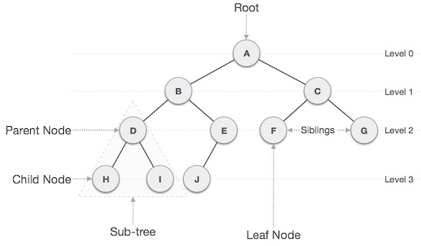

# Trees & Breadth-First Search

- [Essential Questions](#essential-questions)
- [Key Concepts](#key-concepts)
- [Problem: Fast Search *and* Fast Insert](#problem-fast-search-and-fast-insert)
  - [Review: Binary Search in a Sorted Array](#review-binary-search-in-a-sorted-array)
- [Tree Terminology](#tree-terminology)
- [Binary Search Trees](#binary-search-trees)
  - [Insert](#insert)
  - [Search](#search)
  - [When a BST Degrades to O(n)](#when-a-bst-degrades-to-on)
- [Traversing a Tree: Breadth-First Search](#traversing-a-tree-breadth-first-search)
  - [BFS Implementation](#bfs-implementation)
  - [When to Use BFS](#when-to-use-bfs)

## Essential Questions

By the end of this lesson, you should be able to answer these questions:

1. What is a tree, and what tree terminology (root, node, child, parent, leaf, depth, height) describes it?
2. What is a Binary Search Tree's ordering property, and how does it make search fast?
3. What are the average and worst-case time complexities of BST insert/search, and why does the worst case happen?
4. How does Breadth-First Search use a Queue to traverse a tree level by level?
5. What kinds of problems is BFS naturally suited for?

## Key Concepts

* **Tree** - a hierarchical (non-linear) data structure made of nodes connected by edges, where each node has exactly one parent (except the root) and zero or more children.
  * **Root** - the top node of a tree; it has no parent.
  * **Child / Parent** - a node directly connected below/above another node.
  * **Sibling** - nodes that share the same parent.
  * **Leaf** - a node with no children.
  * **Depth** - the distance (number of edges) from the root to a given node.
  * **Height** - the length of the longest path from a node down to a leaf.
* **Binary Tree** - a tree in which each node has at most two children, typically called `left` and `right`.
* **Binary Search Tree (BST)** - a binary tree with an ordering property: every node in a node's left subtree is smaller than it, and every node in its right subtree is larger.
* **Breadth-First Search (BFS)** - a traversal algorithm that visits a tree level by level, using a Queue to keep track of which nodes to visit next.

## Problem: Fast Search *and* Fast Insert

**The Problem**: You need to maintain a growing collection of numbers, and support two operations quickly: checking whether a value exists, and inserting a new value.

Recall from a couple lessons ago that appending to the end of an Array is O(1), but searching for a value is O(n) — with no index to jump to, you have to check every element to know if it's there.

```js
const numbers = [1, 2, 5, 8, 10];

// O(1) — if we know the length, that's the next available index.
numbers[numbers.length] = 13; 

// O(n) — checks every element until it finds (or doesn't find) 4
for (let i = 0; i < arr.length; i++){ 
  if (numbers[i] === 4) {
    console.log("found it!");
  }
}
console.log("4 isn't there");
```

A Linked List (with a `tail` pointer) has this exact same profile: appending is O(1), but search is still O(n) — there's no random access, so you have to walk from the `head`, one node at a time, the same as an unsorted Array.

### Review: Binary Search in a Sorted Array

Recall Binary Search from a couple lessons ago: if an Array is sorted, you can eliminate *half* of the remaining values at every single comparison instead of checking them one at a time

For a sorted Array of 1,000 values, Binary Search needs at most ~10 comparisons; for 1,000,000 values, only ~20. That's what makes it **O(log n)** instead of O(n).



**But keeping the Array sorted has a cost.** A new value usually can't just be pushed onto the end anymore — it has to land in the correct spot to keep everything in order. Binary Search can *find* that spot in O(log n), but actually placing the value there means shifting every element after it over by one, to make room:

So a sorted Array trades away the O(1) insert an unsorted Array had, in exchange for O(log n) search. Every option so far gives you one fast operation at the cost of the other:

|                              | Search   | Insert                                        |
| ---------------------------- | -------- | --------------------------------------------- |
| Unsorted Array / Linked List | O(n)     | O(1) — just add it to the end                 |
| Sorted Array                 | O(log n) | O(n) — find the right index to maintain order |

So, is there a structure that could give you O(log n) for both search AND insert, at the same time? Not with anything linear — a Stack, Queue, Array, or Linked List all arrange values in a single sequence, one after another, which forces exactly this trade-off.

This is exactly the gap a **Tree** fills — the first non-linear structure in this module.

## Tree Terminology



A Tree is a **hierarchical data structure** made of **nodes** connected by **edges**, arranged so that:

* There is exactly one **root** node (the top of the tree, with no parent).
* Every other node has exactly one **parent**.
* A node can have zero or more **children**.
* Nodes with no children are called **leaves**.

Two more terms describe *position* within the tree:

* **Depth** — how far a node is from the root (the root itself has depth `0`).
* **Height** — the longest path from a given node down to a leaf below it (a leaf has height `0`).

Trees aren't only useful for fast search and insert — their branching shape also naturally models hierarchical data: an HTML document (`<html>` containing `<head>` and `<body>`, each containing more elements), a file system (folders containing files and other folders), or an org chart (a CEO managing directors, who each manage reports).

**<details><summary>Q: Since Trees have Nodes and Edges, what Abstract Data Type can we classify them under?</summary>**

Trees are a type of Graph!

</details>

**<details><summary>Q: In a file system, what would the "root" be? What would a "leaf" be?</summary>**

The root would be the top-level directory (e.g. `/`). A leaf would be any file or empty folder — anything with nothing nested underneath it. A folder containing other folders/files would be an internal node (a parent with children, but not a leaf itself).

</details>

Most of this module focuses on a **Binary Tree** — a tree where every node has *at most two* children, conventionally called `left` and `right`:

```js
class BinaryTreeNode {
  constructor(value, left = null, right = null) {
    this.value = value;
    this.left = left;
    this.right = right;
  }
}
```

## Binary Search Trees

A **Binary Search Tree (BST)** is a Binary Tree with one additional rule, applied at every single node:

> Everything in a node's **left** subtree is **smaller** than the node. Everything in its **right** subtree is **larger**.

```
        8
       / \
      3   10
     / \    \
    1   6    14
       / \   /
      4   7 13
```


The ordering rule is relative to *every* ancestor, not just the immediate parent. For example, `6` only needs to be smaller than `8` to belong anywhere in `8`'s left subtree, and larger than `3` to belong in `3`'s right subtree. Both are true at once: `3 < 6 < 8`.

**<details><summary>Q: Where would the value 9 be inserted? What about 5?</summary>**

`12` is greater than `8` so it would go in the right subtree. Since it is less than `10` and `10` has no left subtree, it would end up as the left leaf of the `10` node.

```
       8
     /   \
    3     10
   / \   /  \
  1   6  9   14
     / \    /
    4   7  13
```

`5` is less than `8`, greater than `3`, less than `6`, and greater than `4`. Only after reaching `4` do we find an open space for `5` to go so it becomes the right leaf of the `4` node.

```
       8
     /   \
    3     10
   / \   /  \
  1   6  9   14
     / \    /
    4   7  13
     \
      5
```

</details>

This ordering property is what makes a BST fast to search: at every node, you can eliminate an entire subtree just by comparing against one value — the same "eliminate half the possibilities" idea from binary search on a sorted Array.

### Insert

* Inputs: a `value` to insert
* Behavior: starting at the root, compare `value` to the current node. Go left if smaller, right if larger. Repeat until you reach a `null` spot, and place the new node there.

```js
function insert(root, value) {
  if (!root) return new TreeNode(value);

  if (value < root.value) {
    root.left = insert(root.left, value);
  } else {
    root.right = insert(root.right, value);
  }

  return root;
}
```

<details>

<summary><strong>Q: Why does a new value always end up at a leaf position (as a new leaf), never in the middle of the tree?</strong></summary>

At every node, the only two moves are "go left" or "go right" — there's no operation that inserts a node *between* an existing parent and child. So the search for where to place the new value always continues until it falls off the bottom of the tree (hits a `null`), which is by definition a new leaf position.

</details>

### Search

* Inputs: a `target` value to find
* Behavior: starting at the root, compare `target` to the current node. If equal, found it. If smaller, go left; if larger, go right. If you hit `null`, the value isn't in the tree.

```js
function search(root, target) {
  if (!root) return false;
  if (root.value === target) return true;

  return target < root.value
    ? search(root.left, target)
    : search(root.right, target);
}
```

### When a BST Degrades to O(n)

In a **balanced** BST (roughly the same number of nodes on the left and right of every node), both `insert` and `search` run in **O(log n)** — each comparison eliminates about half the remaining nodes, just like binary search.

<details>

<summary><strong>Q: What happens to search time if you insert values in already-sorted order — 1, 2, 3, 4, 5 — into an empty BST?</strong></summary>

Every value is larger than the one before it, so every new node becomes the *right* child of the previous one. The "tree" ends up as a single chain leaning entirely to the right — structurally identical to a Linked List:

```
1
 \
  2
   \
    3
     \
      4
       \
        5
```

Searching for `5` now requires visiting every node — there's no branching left to eliminate. This is the **worst case**, and it makes both `insert` and `search` **O(n)** instead of O(log n).

</details>

This is why the BST's speed is described as "average case O(log n), worst case O(n)" — the O(log n) guarantee depends entirely on the tree staying roughly balanced. (Some BST variants automatically re-balance themselves after every insertion to guarantee O(log n) — that's beyond the scope of this lesson, but it's the reason those variants exist.)

## Traversing a Tree: Breadth-First Search

Inserting and searching answer "does this value exist, and where does a new one go?" But a common need is different: **visit every node in the tree**, in some defined order. This is called **traversal**.

The first traversal strategy is one you already have all the tools for: **Breadth-First Search (BFS)** visits a tree **level by level** — every node at depth `1`, then every node at depth `2`, and so on.

```
        8            <- level 0
       / \
      3   10         <- level 1
     / \    \
    1   6    14       <- level 2
```

BFS on this tree visits: `8, 3, 10, 1, 6, 14`.

<details>

<summary><strong>Q: You already built a data structure whose entire job is "keep track of what to process next, in the order it was discovered." Which one, and how might it help traverse level by level?</strong></summary>

A **Queue**. If you enqueue a node's children right after visiting it, the Queue naturally keeps every node at the *current* level ahead of every node at the *next* level — because they were discovered (enqueued) first. Dequeuing in FIFO order automatically produces a level-by-level visit order, without ever having to track "which level am I on" explicitly.

</details>

### BFS Implementation

```js
function bfs(root) {
  if (!root) return [];

  const visited = [];
  const queue = new Queue();
  queue.enqueue(root);

  while (queue.peek()) {
    const node = queue.dequeue();
    visited.push(node.value);

    if (node.left) queue.enqueue(node.left);
    if (node.right) queue.enqueue(node.right);
  }

  return visited;
}
```

1. Start by enqueuing the `root` — it's the first (and only) node at level 0.
2. As long as the Queue isn't empty, dequeue the front node and visit it.
3. Enqueue that node's children (if any) — they'll be dequeued only after every other node already waiting in the Queue, which is exactly what keeps the traversal in level order.
4. Repeat until the Queue is empty — every node has been visited exactly once.

This is precisely the `Queue` class from the Stacks & Queues and Linked Lists lessons — nothing new to build here, just a new problem that happens to need exactly the FIFO guarantee a Queue already provides.

### When to Use BFS

BFS is the natural choice whenever a problem cares about **level** or **distance from the start**:

* **Shortest path in an unweighted structure** — the first time BFS reaches a target node is guaranteed to be via the shortest possible path, since it never visits a node at depth `d + 1` before it's visited every node at depth `d`.
* **Level-order processing** — e.g., "print a tree level by level," or "find the average value at each depth."

<details>

<summary><strong>Q: Why does BFS specifically guarantee the *shortest* path, when a different traversal order might not?</strong></summary>

Because BFS never moves on to depth `d + 1` until every node at depth `d` has already been visited. If a target node exists at depth `3`, BFS is guaranteed to have already ruled out every possible path of length `0`, `1`, or `2` before it ever reaches that node — so whatever path BFS used to first reach it must be the shortest one possible.

</details>
