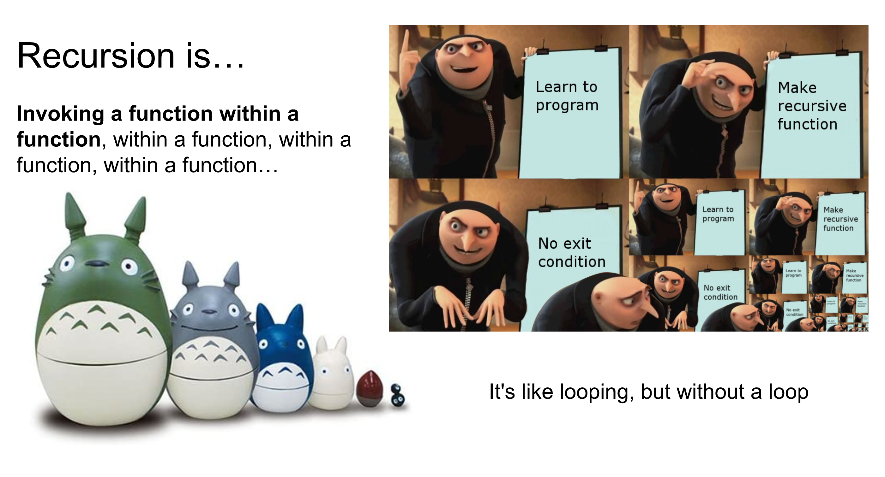

# Recursion

You've now built both BFS and DFS iteratively, using a Queue and a Stack you managed by hand. Recursion is a different way to get the same traversal behavior — one where the call stack does that bookkeeping for you, automatically.



**Table of Contents:**
- [Essential Questions](#essential-questions)
- [Key Concepts](#key-concepts)
- [Problem: Triangle Sum](#problem-triangle-sum)
- [Base Case \& Recursive Case](#base-case--recursive-case)
- [The Recursive Process](#the-recursive-process)
- [Challenge: Recursive DFS](#challenge-recursive-dfs)
- [Recursion vs. Iteration](#recursion-vs-iteration)

## Essential Questions

By the end of this lesson, you should be able to answer these questions:

1. What is the base case of a recursive function? What is the recursive case?
2. What happens if a recursive function is missing a base case, or the base case is wrong?
3. How can you trace the call stack of a recursive function by hand?
4. What are the tradeoffs between a recursive solution and an iterative one?

## Key Concepts

* **Recursion** - when a function calls itself.
  * **Base Case** - a condition within a recursive function that stops it from calling itself infinitely; the smallest version of the problem, solved directly without another recursive call.
  * **Recursive Case** - the part of the function that calls itself again, with a smaller/simpler version of the original input.
* **Call Stack** - the Stack data structure JavaScript uses to keep track of function calls. Every time a function is invoked, it's pushed onto the call stack; when it returns, it's popped off.
  * **Stack Trace** - an error log showing the state of the call stack at the moment an error occurred.
  * **Stack Overflow** - an error that occurs when the call stack runs out of memory (too many calls have been pushed without being popped), typically because a recursive function never reaches its base case.

## Problem: Triangle Sum

**The Problem**: Write a function, `triangleSum(n)`, that returns the sum of all numbers from `1` up to `n`.

```js
triangleSum(1); // => 1
triangleSum(2); // => 1 + 2 => 3
triangleSum(3); // => 1 + 2 + 3 => 6
triangleSum(4); // => 1 + 2 + 3 + 4 => 10
triangleSum(5); // => 1 + 2 + 3 + 4 + 5 => 15
```

Here's a straightforward **iterative solution** — one that uses a loop:

```js
function triangleSum(n) {
  let sum = 0;
  for (let i = 1; i <= n; i++) {
    sum += i;
  }
  return sum;
}
```

Now look at the relationship between consecutive calls instead of the loop:

```
triangleSum(1) = 1
triangleSum(2) = 2 + triangleSum(1) = 2 + (1)
triangleSum(3) = 3 + triangleSum(2) = 3 + (2 + 1)
triangleSum(4) = 4 + triangleSum(3) = 4 + (3 + 2 + 1)
triangleSum(5) = 5 + triangleSum(4) = 5 + (4 + 3 + 2 + 1)
```

<!-- [insert visual: staircase-of-squares progression showing tSum(1) through tSum(5) growing, from slides 6-7 of the old deck — a good candidate to split across several clickable slides showing the staircase grow one step at a time] -->

<details>

<summary><strong>Q: Based on the pattern above, how does `triangleSum(n)` relate to `triangleSum(n - 1)`?</strong></summary>

`triangleSum(n) = n + triangleSum(n - 1)`. Each call just adds its own number (`n`) to the answer for a slightly smaller problem (`n - 1`). This is the core idea behind recursion: **trust that a smaller version of the same problem already has an answer, and build on top of it.** You don't need to see the whole staircase at once — you only need to trust that `triangleSum(n - 1)` works, the same way you'd trust a smaller version of any problem you already know how to solve.

</details>

## Base Case & Recursive Case

Every recursive function needs two parts:

* The **base case** — the smallest version of the problem, small enough that you can just answer it directly, with no further recursion.
* The **recursive case** — every other input, handled by calling the function again with a smaller input.

For `triangleSum`, the smallest possible input is `0` (the sum of "all numbers from 1 to 0" is just `0` — there's nothing to add).

```js
function triangleSum(n) {
  if (n === 0) {          // base case
    return 0;
  } else {                // recursive case
    return n + triangleSum(n - 1);
  }
}
```

<!-- [insert visual: nested-boxes diagram showing X=5 containing X=4 containing X=3... from slide 9 of the old deck — pairs well with explaining what the call stack looks like mid-recursion] -->

Each call to `triangleSum` is pushed onto the **call stack** and stays there — waiting on the result of the next call — until the base case is finally reached. Once the base case returns a real value, every waiting call resolves in reverse order, from the inside out.

<details>

<summary><strong>Q: What happens if the base case is removed entirely?</strong></summary>

```js
function triangleSum(n) {
  // if (n === 0) {
  //   return 0;
  // }
  return n + triangleSum(n - 1);
}
```

There's nothing to stop the recursive case from calling itself again — `n` just keeps decreasing (`5, 4, 3, 2, 1, 0, -1, -2, ...`) forever. Every one of those calls gets pushed onto the call stack, and none of them ever get popped off, since none of them return. Eventually the call stack runs out of room and JavaScript throws a **stack overflow** error (`RangeError: Maximum call stack size exceeded`). A missing or incorrect base case is one of the most common recursion bugs — always start by asking "what's the smallest input this function needs to handle directly?"

</details>

## The Recursive Process

A reliable process for writing any recursive function:

1. Figure out the smallest/simplest version of the problem — that's your **base case**.
2. Solve the problem for the base case directly (no recursive call).
3. Test the base case in isolation.
4. Figure out how a "bigger" input relates to a smaller one — that's your **recursive case**.
5. Write the recursive case, invoking the function again with a smaller/simpler input.
6. Test with progressively larger inputs.

## Challenge: Recursive DFS

**The Problem**: Recall how you implemented Depth-First Search iteratively, using an explicit `Stack` to keep track of which nodes still needed to be visited. Rewrite it recursively instead — this time, let the call stack do that bookkeeping for you.

```js
function dfs(node) {
  if (!node) return; // ???
  // visit node
  // recurse into its children
}
```

<details>

<summary><strong>Q: What's the smallest/simplest input this function needs to handle directly? That's your base case.</strong></summary>

A `null` node — there's nothing to visit and nothing to recurse into, so the function should just return immediately.

</details>

<details>

<summary><strong>Solution (binary tree)</strong></summary>

```js
function dfs(node) {
  if (!node) return;         // base case: nothing here, stop

  console.log(node.value);    // visit this node
  dfs(node.left);              // recursive case: trust that this
  dfs(node.right);             //   correctly visits the whole subtree
}
```

1. The base case handles a `null` node — the recursion naturally stops once it walks off the bottom of the tree.
2. The recursive case visits the current node, then calls `dfs` again on the left child and the right child — **trusting** that each of those calls already knows how to correctly traverse everything below it, the exact same way `triangleSum(n - 1)` trusted that a smaller version of itself was already solved.

Compare this to the iterative version: there, you had to manually `push` and `pop` nodes from your own `Stack` to keep track of where to go next. Here, every call to `dfs` *is* a push onto the call stack, and every `return` is a pop — the recursion handles the exact bookkeeping you were previously doing by hand.

</details>

<details>

<summary><strong>Q: This visits the node, then its left subtree, then its right subtree — which DFS ordering is that?</strong></summary>

Pre-order traversal (node, then left, then right). Moving the `console.log(node.value)` line to *between* the two recursive calls gives you in-order; moving it *after* both gives you post-order — the position of "visit the node" relative to the recursive calls is the only thing that changes between the three orderings.

</details>

For a tree where a node can have any number of children (not just `left`/`right`), the same idea extends naturally — recurse into every child instead of just two:

```js
function dfs(node) {
  if (!node) return;
  console.log(node.value);
  for (const child of node.children) {
    dfs(child);
  }
}
```

## Recursion vs. Iteration

A recursive solution is an alternative to an iterative one — anything you can write with a loop (or, as you just saw, with an explicit Stack), you can rewrite recursively, and vice versa.

|             | Recursion                                                                                       | Iteration                                                                             |
| ----------- | ----------------------------------------------------------------------------------------------- | ------------------------------------------------------------------------------------- |
| Readability | Often more concise, especially for problems that are naturally recursive (tree/graph traversal) | Can be more verbose for those same problems                                           |
| Memory      | Uses more memory — every call sits on the call stack until it returns                           | Uses a fixed, small amount of memory regardless of how many iterations run            |
| Speed       | Often slower — function calls are more expensive than loop iterations                           | Generally faster for simple repeated operations                                       |
| Risk        | Missing/incorrect base case → stack overflow                                                    | Missing/incorrect loop condition → infinite loop (no stack overflow, but still hangs) |

Recall from the Stacks lesson that the call stack — the mechanism behind every function call — is itself a Stack. Recursive DFS is where that fact stops being trivia and starts mattering directly: the iterative version made you manage a `Stack` yourself; the recursive version is doing the exact same push/pop bookkeeping, just automatically, one call stack frame at a time.

This is also why recursive DFS is a completely natural fit and recursive BFS is awkward and rarely used: DFS's "explore fully, then backtrack" behavior *is* LIFO order, which the call stack already gives you for free. BFS's "explore level by level" behavior is FIFO order — the opposite of what a call stack provides — which is exactly why BFS stayed married to an explicit Queue instead.
