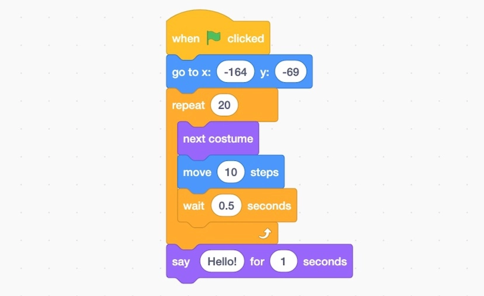

# Prework Project Overview

**Duration:** 3 weeks

**Format:** Independent build + written reflection + in-person presentation during Orientation Week

**Table of Contents**

- [Overview](#overview)
  - [Why Scratch?](#why-scratch)
  - [What This Assignment Is Actually Measuring](#what-this-assignment-is-actually-measuring)
  - [Requirements and Deliverables](#requirements-and-deliverables)
  - [Written Reflection (Submit with Final Project)](#written-reflection-submit-with-final-project)
  - [Getting Started](#getting-started)
- [Office Hours and Geekouts](#office-hours-and-geekouts)
- [Resources for Managing Your Time and Getting Help](#resources-for-managing-your-time-and-getting-help)
  - [Sample Weekly Project Plan](#sample-weekly-project-plan)
  - [Feeling Stuck and Where to Turn For Help](#feeling-stuck-and-where-to-turn-for-help)
  - [Need More Information about Scratch?](#need-more-information-about-scratch)

## Overview

The Marcy Labs Software Engineering fellowship starts with an open-ended project built in [Scratch](https://scratch.mit.edu/)!

Scratch is **a free, block-based visual programming language created by MIT**. Instead of typing text commands, users drag and drop colorful blocks like puzzle pieces to build animations, games, and interactive stories.

What you build for this project is entirely up to you! For example you could build:

* **A simple game** — something like Pong, a maze/collector game, or a simple platformer where a score or timer changes based on player actions
* **A quiz or trivia app** — questions triggered by broadcasts, a running score variable, branching feedback based on right/wrong answers
* **A simulator** — a simple weather system, a traffic light, a vending machine, or a "virtual pet" whose stats change over time and based on user input
* **A story or dialogue app** — multiple characters (sprites) that communicate via broadcasts, with a variable like "trust" or "mood" that shifts the story's direction

You don't have to pick one of these — if you have your own idea that meets the requirements below, go for it!

### Why Scratch?

Why do we ask you to begin with a drag-and-drop coding language like Scratch? **We're using Scratch on purpose, to strip away syntax, so you can focus entirely on the thinking that makes someone a good engineer.**

Every professional software engineer is working with the same underlying ideas you'll practice in this project:

* **state** (variables that change over time)
* **control flow** (decisions and repetition)
* **events** (things happening in response to other things).

The only difference between what you'll build here and a production application is the notation (a.k.a. “Syntax”). Mastering these fundamental coding concepts will make learning how to code in JavaScript or Python or C or OCaml much easier. You will then be better equipped to learn a second or even a third language!

Starting with Scratch lets you practice these skills without also struggling through syntax of a new language. Scratch removes the implementation barrier — you drag blocks instead of memorizing syntax — so you can focus on the computational thinking underneath.

This isn't just training wheels. It's how programming works now. AI can write the code. What it can't do is know if the underlying logic is correct — that's still on you. The concepts you learn here are what let you organize your thinking in code, catch conceptual errors, and know if the code matches your intent, whether you wrote the code yourself or an AI did.

### What This Assignment Is Actually Measuring

While we will be checking to see if your projects meet the technical requirements below, **this pre-work is not a technical assessment. It is our first real signal on&#x20;**_**how**_**&#x20;you operate, not&#x20;**_**what**_**&#x20;you know**. We're watching to see if you can:

* Build and hold a mental model of a system with moving, interacting parts
* Build methodically rather than by luck or panic
* Communicate clearly about technical decisions — including your uncertainty
* Manage your own time across a 3-week, mostly unstructured window
* Communicate proactively if you are struggling to understand a difficult concept
* Communicate before missing a deadline

That last two points matter as much as the code. In the fellowship, deadlines will happen. What separates fellows who thrive from fellows who struggle isn't whether they ever miss a deadline — it's whether they tell someone _before_ it's a problem.&#x20;

We also want you to be able to develop the essential skills needed to navigate challenges and roadblocks on your own. During your year at Marcy, you will have opportunities to develop these skills:

* Being able to quickly identify when you’re stuck and what you are stuck on
* Normalizing that getting stuck is an inherent part of programming and getting unstuck is a skill to practice
* Shifting the conversation from _“I’m good at this vs. I’m bad at this”_ to _“Where am I in my learning journey and what is my next step?”_

### Requirements and Deliverables

Before you start building, keep in mind that your project must include **3 of the 4 requirements below**:

* **At least two dynamic variables** (e.g., `score`, `time`, `balance`) that change while the program runs
* **Conditional statements** (an `if/else` statement)
* **At least two event triggers** (e.g. using Scratch's “When \[Flag] Clicked” block)
* **A main execution loop** (e.g., `forever` or `repeat`)

To ensure that you stay on track, there will be **three clear due dates and deliverables.** These deliverables are opportunities to demonstrate your **time and task management** and **communication.** If you're going to miss a checkpoint deadline, **message us before it's due, not after.** That single behavior tells us more about how you'll do in the fellowship than the deliverable content itself.\\

**Deliverable Due Dates:**

<table><thead><tr><th width="119.4375">Due</th><th>Deliverable</th></tr></thead><tbody><tr><td>Friday, Week 1</td><td>A short written description (a few sentences is fine): what you're planning to build and why. Doesn't need to be final — plans can change.</td></tr><tr><td>Friday, Week 2</td><td>A screenshot or short screen recording of your project so far, working or not. We want to see where you are, not a finished product.</td></tr><tr><td>Friday, Week 3</td><td>Your finished Scratch project + written reflection (below). Presented in person during Orientation Week.</td></tr></tbody></table>

If you're stuck at any checkpoint — truly stuck, not just behind — reach out. Asking for help early is a skill, not a weakness, and we'd rather hear from you in week 1 than get silence until week 3.

### Written Reflection (Submit with Final Project)

As you build, reflect on the questions below. Then, when you are finished, write up your responses in your own words. There's no minimum length — a clear, honest paragraph beats a long and verbose one. This is a technical communication exercise as much as anything else.

1. **What did you build?**
2. **Why did you build it?** (What made you choose this idea?)
3. **What are a few of the variables used in your application, and how do their values change?**
4. **Share an example of a conditional statement used in your application.** What does it check, and what does it do based on the result?
5. **What events are present in your application? How do they affect what happens?**
6. **Describe one bug or unexpected behavior you ran into, and how you figured out what was wrong.** (Every project has at least one of these — tell us about the process, not just the fix.)
7. **What would you add if you had more time?**

Your answers to these questions will support you as you share your project with your classmates in person during Orientation Week. Come ready to briefly walk someone through what you built, run it live, and answer questions about your reflection above — particularly the debugging story. Treat it like showing a project to a new coworker: assume they haven't seen it, and make it easy for them to follow what's happening and why.

### Getting Started

Now that you know what this project is all about, let's get started! We can't wait to see what you build!

If you've never used Scratch before, start here:

* **Explore Starter Projects and Remix one:** https://scratch.mit.edu/starter-projects
* **Scratch's official "Getting Started" tutorial:** https://scratch.mit.edu/projects/editor/?tutorial=getStarted
* **Explore the Scratch Community:** https://scratch.mit.edu/explore/projects/all
* **Find a YouTube Tutorial!** https://www.youtube.com/watch?v=zOa5o9Yq\_ZU

## Office Hours and Geekouts

To support you in completing this assignment, we will be hosting **three Zoom Office Hours** sessions and **three in-person “Geekouts”**

* **Office hours will occur every Friday on Zoom**. They are times to receive direct support and attention for your instructors.
* The **Geekouts will occur every Wednesday at Marcy**. They will serve the purpose of community building, sharing progress and excitement about the project with your classmates and instructors, and fostering collaboration and support between classmates.

**Geek Out Schedule**

<table><thead><tr><th width="127.9375">Touch Point</th><th width="119.4375">When</th><th width="108.54296875">Where</th><th>What's expected</th></tr></thead><tbody><tr><td><strong>Geek Out #1</strong></td><td>Wednesday, Week 1</td><td>In Person</td><td>Share some existing Scratch games you’ve found and enjoyed. Remix a project from the Scratch Community together in pairs. Meet your future classmates!</td></tr><tr><td><strong>Geek Out #2</strong></td><td>Wednesday, Week 2</td><td>In Person</td><td>Share your progress so far. Play around with each others’ projects and gather feedback about ideas for finishing it. If you are behind, get help with getting started.</td></tr><tr><td><strong>Geek Out #3</strong></td><td>Wednesday, Week 3</td><td>In Person</td><td>Get feedback about playability and brainstorm ideas to make your game better.</td></tr></tbody></table>

## Resources for Managing Your Time and Getting Help

One goal of this assignment is to practice managing your time across a project that is bigger than a single class activity. Open-ended work can feel exciting, but it can also feel overwhelming. That feeling is normal when you are learning something new.

The goal is to practice a software engineering habit: **turn a big, unclear project into a smaller next step you can actually build, test, and explain.**

Each week, use this planning process:

1. **Name the goal.** What am I trying to accomplish this week?
2. **Shrink the scope.** What is the smallest version I can build, test, and explain?
3. **Use what I know.** What skills or knowledge do I already have that can help?
4. **Build one thing.** What can I try next that will teach me something?
5. **Find the next thing to learn.** What is the smallest new skill or concept I need right now to build the feature?

You can build your own plan, or use the sample plan below if you want more structure.

### Sample Weekly Project Plan

If you want more structure, use this sample plan to see one way to break the project into weekly goals, checkpoints, and smaller build steps.

[Sample Weekly Project Plan](weekly-project-structure.md)

### Feeling Stuck and Where to Turn For Help

Use this page when you are stuck, unsure what kind of help to ask for, or trying to decide whether to ask the computer, a peer, or a teacher.

[Help Ladder: Computer → Peer → Teacher](getting-help.md)

### Need More Information about Scratch?

Use this page when you need help with Scratch basics or the core technical requirements: variables, loops, conditionals, nested conditionals, and broadcasts.

[Scratch Basics & Core Requirements](scratch-basic-concepts.md)
